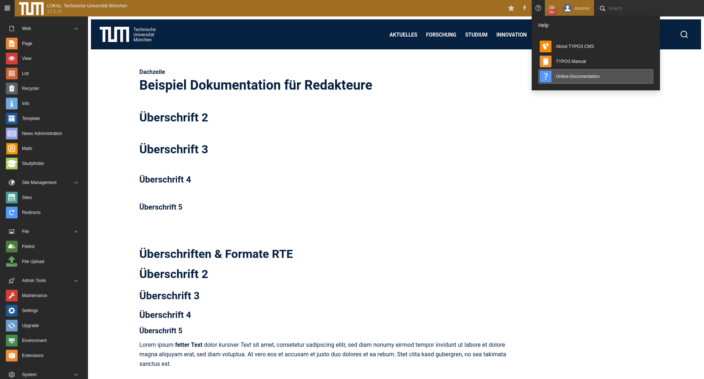

# Extension in2help

## What does it do?

The extension adds a module to the help section in the backend of
your installation. You can define a page ID, which is loaded into this module.
The idea is, that you can provide your editors an entry point, into the
editors documentation.

Basically you write the documentation about content elements and functions in
the backend and use the frontend rendering to display it.

## Screenshots

## Configuration

The extension configuration can be set up in the extension configuration.

Options:
* PID of help page: basic.helpPid (int+) -> the PID of the page which
contains the documentation.

## Tips

### Adjust page rendering

In order to provide the best experience for your editors, you should try to keep
the header of your layout small. You could hide elements, which are just
ornaments.

### Provide user / page TS to set this module as starting point

You can set up PageTS or UserTS to force users, to get this module as start
module.

setup.override.startModule = help_In2helpM1

## Changelog

| Version    | Date       | State      | Description                                                                  |
| ---------- | ---------- | ---------- | ---------------------------------------------------------------------------- |
| 6.0.0 !!!  | 2022-06-23 | Task       | Support for TYPO3 11 and 10 (9 is dropped now)                               |
| 5.0.1      | 2021-05-19 | Task       | Add github workflow; add extensionkey to composer.json                       |
| 5.0.0      | 2020-04-24 | Task       | Release for TYPO3 10.4                                                       |
| 4.0.0      | 2019-04-08 | Task       | Release for TYPO3 9.5                                                        |

## Breaking changes

### Updating fom earlier versions to 6

We just changed the configuration key in LocalConfiguration.php from `designPatternPid` to `helpPid` because this
extension is used to show documentations while it was once created to show a designPattern.